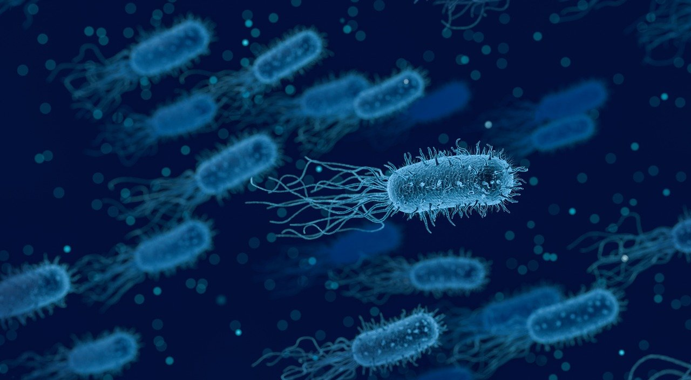

Github Link: https://github.com/zazauwu/Rentrez

## Import the Sequences.csv file
```{r}
Data <- read.csv("A5_LI_ZHIJUN_Sequences.csv")
```

```{r}
library(rentrez)
library(dplyr)
```

## Print out each sequence.
```{r}
print(Data$Sequence)
```

## Count the number of each base pair (A, T, C and G), in each of the three sequences
```{r}
#convert each sequence from a character to a vector of base pairs
Seq1 <- strsplit(Data$Sequence, "")[[1]]
Seq2 <- strsplit(Data$Sequence, "")[[2]]
Seq3 <- strsplit(Data$Sequence, "")[[3]]

#count the number
Count_A1 = sum(grepl("A", Seq1))
Count_T1 = sum(grepl("T", Seq1))
Count_G1 = sum(grepl("G", Seq1))
Count_C1 = sum(grepl("C", Seq1))

Count_A2 = sum(grepl("A", Seq2))
Count_T2 = sum(grepl("T", Seq2))
Count_G2 = sum(grepl("G", Seq2))
Count_C2 = sum(grepl("C", Seq2))

Count_A3 = sum(grepl("A", Seq3))
Count_T3 = sum(grepl("T", Seq3))
Count_G3 = sum(grepl("G", Seq3))
Count_C3 = sum(grepl("C", Seq3))
```

## Print out the number as a table
```{r}
Name1 = gsub("(HQ433692.1).*", "\\1", Data$Name)[[1]]
Name2 = gsub("(HQ433694.1).*", "\\1", Data$Name)[[2]]
Name3 = gsub("(HQ433691.1).*", "\\1", Data$Name)[[3]]

Count_Table <- data.frame(Sequence_ID = c(Name1, Name2, Name3),
                          A = c(Count_A1, Count_A2, Count_A3),
                          T = c(Count_T1, Count_T2, Count_T3),
                          C = c(Count_C1, Count_C2, Count_C3),
                          G = c(Count_G1, Count_G2, Count_G3))

Count_Table
```

## Include an image of a bacteria from the internet, and a link to the Wikipedia page about Borrelia burgdorferi


[Link: Wikipedia for Borrelia burgdorferi](https://en.wikipedia.org/wiki/Borrelia_burgdorferi)


## Calculate GC Content and create a final table showing GC content for each sequence ID
```{r}
library(formattable) #this package helps format the output

Count_Table %>%
  group_by(Sequence_ID) %>%
  summarise(GC_Content = (G+C)/(A+T+C+G)) %>%
  mutate(GC_Content = formattable::percent(GC_Content))
```

